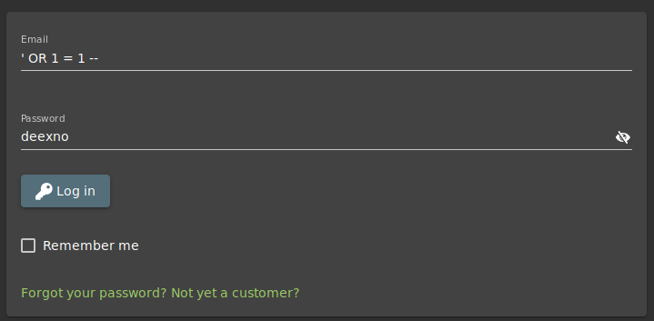
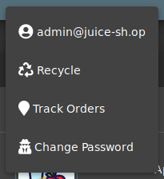
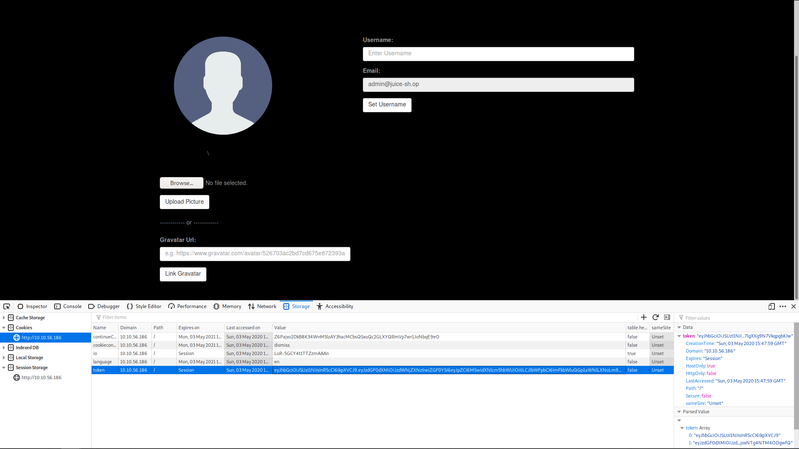

# Intro
In the beginning I tried to collect some information, this part is not important for the Writeup (more or less) but I will introduce it here anyway and you are welcome to skip it.

Show Intro

## First I looked at all comments under the products and found the following emails:
* *admin@juice-sh.op
* *jim@juice-sh.op
* *bender@juice-sh.op
* *mc.safesearch@juice-sh.op

## Afterwards I tried to login with the username: ' and the password ' which allowed me to find out how the SQL query is constructed:
--> sql: "SELECT * FROM Users WHERE email = ''' AND password = 'e034fb6b66aacc1d48f445ddfb08da98'"

## And in the robots.txt file I found a subdirectory called: ftp (I will go into this in more detail later)

## I also ran gobuster and found the following subdirectories which might be interesting
* */#/administration
* */#/track-order

## TASK 4

TASK 4

## #1 Log in with the administrator's user account using SQL Injection

At this task we try to log in as the administrator without knowing his password or his Email-address 

1. First we read the SQL statement which we have discovered
(sql: "SELECT * FROM Users WHERE email = ''' AND password = 'e034fb6b66aacc1d48f445ddfb08da98'")

2. By using the SQL statement we can see that we can skip the verification of the password with:

' OR 1=1 --

If we now login with the following credentials we will see that we are logged in as the administrator

Email: ' OR 1=1 --
Password: '

 

# TASK 5

TASK 5

  
## #1 reset Jim's password using the forgotten password mechanism - what was the answer to the secret question?

This task is very simple. We could try to bruteforce the secret question but that is far too complicated compared to the other solution. Becuase the Soulution is:

1. Search for Jim (Jim kirk) on Google 

2. Open up the Wikipedia article about him (James T. Kirk) and it says that the eldest sibling middle name of him is "Samuel"

*ANS: Samuel

## #2 What is the administrator password?

In this task we have to find out the password from the administrator and for this reason we do the following:

1. We open up the account of the administrator

2. We open up the "Inspect Element" (F12) and go to "Storage" ---and---then---to---> "Cookies", there you will see an element with the name "token". Copy that token.

3. Next we have to decode this token. For this reason we go to: http://calebb.net/ and enter the token there. We should then get the following output:

{
 alg: "RS256."
 type: "JWT"
}.
{
 status: "success",
 data: {
  id: 1,
  username: "",
  email: "admin@juice-sh.op",
  password: "0192023a7bbd73250516f069df18b500",
  isAdmin: true,
  lastLoginIp: "0.0.0.0"
  profileImage: "default.svg"
  createdAt: "2020-05-03 12:29:45.264 +00:00",
  updatedAt: "2020-05-03 12:29:45,264 +00:00"
 },
 iat: 1588514343,
 exp: 1588532343
}

4. Now we can start "hash-identifier" on klai and try to find out how this password was hashed. "Hash-identifier" then should tells us that it is a MD5 hash.

5. So we go to https://www.md5online.org/ and enter there our hash. After we decrypted it, we shopuld get the following password:

*ANS: admin123
  

# TASK 6

TASK 6

## #1 Access a confidential document and enter the name of the first file with the extension ".md"

Now we use the previously found subdirectory. (/ftp)

To solve this task we simply go to /ftp and there we should see several markdowns. There we should also find a file with the name: "acquisitions.md". This file is the "confidential" file and therefore the solution.

*ANS: /ftp/acquisitions.md

# TASK 7

TASK 7

  
## #1 Access the administration section of the store - What is the name of the page?

We have already found the solution to this problem with gobuster. 

*ANS: administration

## #2 Access someone else's basket

1. Add some Items to your basket

2. Go to your basket and open up the "Inspect Element"

3. Open Up: "Storage" ---and---then---> "Session Storage"

4. You will see now an Item in there with the name "bid". Replace that "bid" with a random number f.ex. 1

5. Then reload the Website and you will see a basket of somebody else with the bid "1"

## #3 Get rid of all 5 star customer feedback

Now we have the task to delete a comment which has a 5 star rating/feedback. For that reason er we do the following:  

1. go to /#/administration

2. Delete the top feedback that has a 5 star rating

# TASK 8

TASK 8

  
## #1 Carry out reflected XSS using Tracking Orders && #2 Carry out XSS using the Search field?
 
These last 2 tasks are again veeeeeery simple and more or less the same. To solve them do the following: 

1. Open up /#/track-order

2. Enter "" instead of the tracking number and execute it by pressing the "tracking" button.

3. For the 2nd task do the same, just enter the JS code in the search bar and runn it by pressing the "Search" button.  
  

